# Technical Architecture - Visual Diagrams
## AI-Powered QA Automation Platform

**Generated**: May 2026  
**Purpose**: Visual representation of system components, data flows, and integration points

---

## 1. Three-Layer Architecture Overview

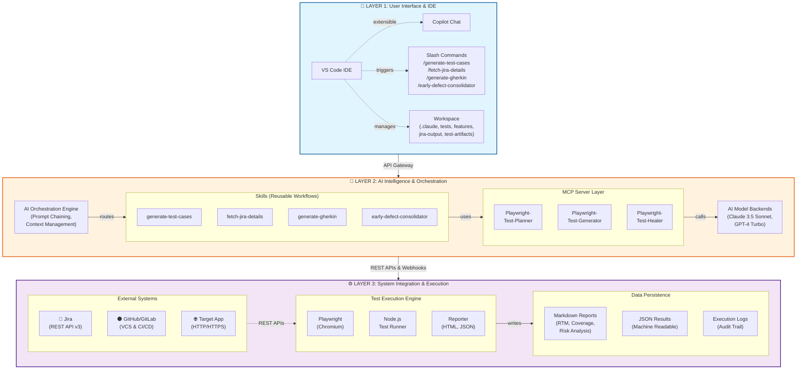

---

## 2. End-to-End Workflow (Test Generation)

```mermaid
graph LR
    A["User Input<br/>/generate-test-cases<br/>TICKET:UWB-1<br/>URL:https://..."] 
    
    B["STEP 0:<br/>Input Parsing<br/>& Mode Detection"]
    
    C["STEP 0A:<br/>Load Jira Context<br/>(Acceptance Criteria)"]
    
    D["STEP 1:<br/>Browser Crawl<br/>(Playwright MCP)<br/>+ Screenshots"]
    
    E["STEP 2:<br/>Discrepancy<br/>Detection<br/>(Claude Analysis)"]
    
    F["STEP 3:<br/>Test Case<br/>Generation<br/>(Playwright Gen)"]
    
    G["STEP 4:<br/>Gherkin<br/>Feature<br/>Generation"]
    
    H["STEP 5:<br/>Report<br/>Generation<br/>(RTM, Coverage,<br/>Risk Analysis)"]
    
    I["Output:<br/>test-artifacts/<br/>TICKET>/"]
    
    A -->|validate| B
    B -->|if JIRA mode| C
    B -->|crawl app| D
    C -->|cross-reference| D
    D -->|compare spec vs app| E
    E -->|document issues| F
    F -->|structured specs| G
    G -->|BDD scenarios| H
    H -->|markdown + json| I
    
    style A fill:#e3f2fd
    style B fill:#fff9c4
    style C fill:#fff9c4
    style D fill:#fff9c4
    style E fill:#fff9c4
    style F fill:#fff9c4
    style G fill:#fff9c4
    style H fill:#fff9c4
    style I fill:#c8e6c9
```

---

## 3. Data Flow: Jira → AI → Tests → Defects

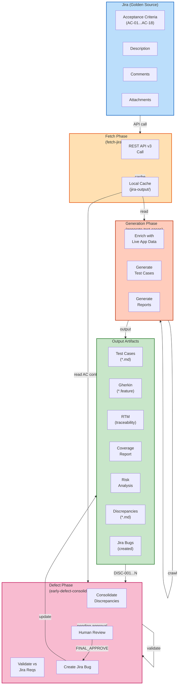

---

## 4. MCP Server Architecture

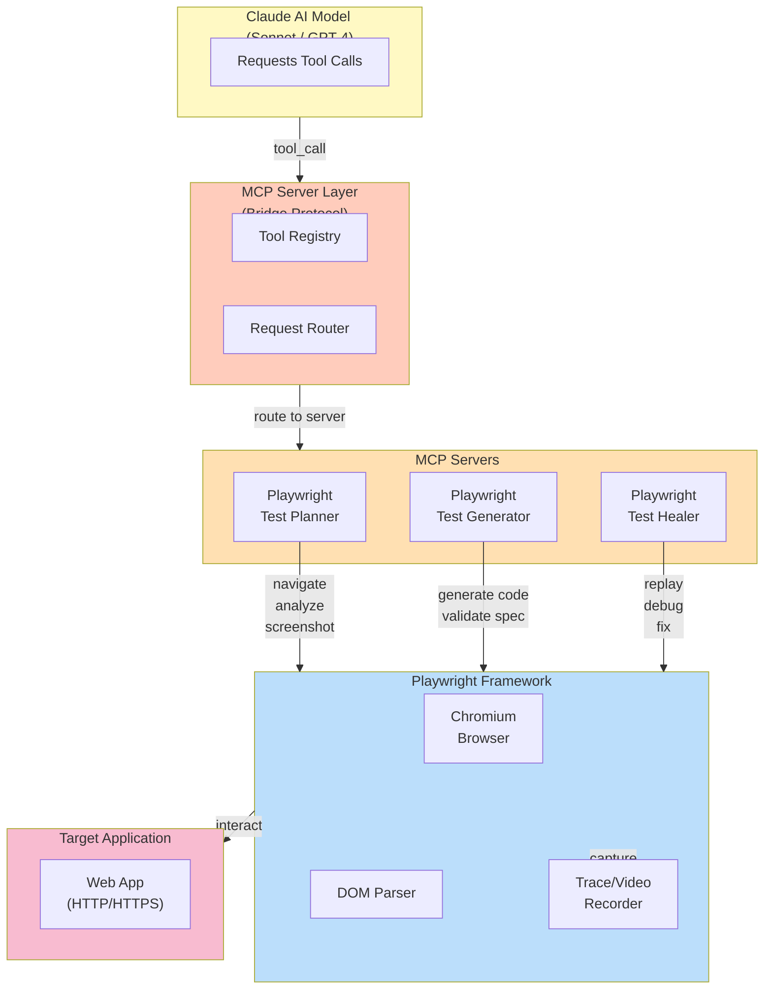

---

## 5. Requirements Traceability Matrix (RTM) Generation

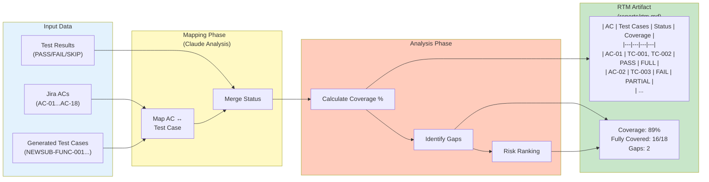

---

## 6. Discrepancy Detection & Defect Creation

```mermaid
stateDiagram-v2
    [*] --> GenerateTests: /generate-test-cases<br/>TICKET_ID
    
    GenerateTests --> CompareSpec: Step 1-2:<br/>Crawl app +<br/>Extract ACs
    CompareSpec --> IdentifyDiscrepancies: Compare<br/>Spec vs Actual
    
    IdentifyDiscrepancies --> DiscFile: Write to<br/>discrepancies.md<br/>(DISC-001...N)
    
    DiscFile --> ConsolidatorWait: /early-defect-consolidator<br/>TICKET_ID<br/>(Waiting for input)
    
    ConsolidatorWait --> ValidatePhase: Load discrepancies +<br/>Jira context
    ValidatePhase --> GenerateReview: Generate Review<br/>Report
    GenerateReview --> HumanReview: Present to<br/>Reviewer
    
    HumanReview --> Approved: FINAL_APPROVE<br/>response
    HumanReview --> Rejected: Reject or<br/>Request Changes
    
    Rejected --> UpdateDiscFile: Update<br/>discrepancies.md<br/>with feedback
    UpdateDiscFile --> GenerateReview
    
    Approved --> CreateBug: Auto-create<br/>Jira Bug
    CreateBug --> UpdateTraceability: Update<br/>Discrepancies.md<br/>with Bug Key
    UpdateTraceability --> [*]
    
    note right of IdentifyDiscrepancies
        Severity Classification:
        - Critical: Blocks feature
        - High: Breaks workflow
        - Medium: Workaround exists
        - Low: Cosmetic only
    end
    
    note right of HumanReview
        Review Approval Gate:
        - Only FINAL_APPROVE
          triggers Jira creation
        - Other responses loop
          back to feedback
    end
    
    style ConsolidatorWait fill:#fff9c4
    style HumanReview fill:#ffccbc
    style CreateBug fill:#c8e6c9
    style UpdateTraceability fill:#c8e6c9
```

---

## 7. CI/CD Integration Flow

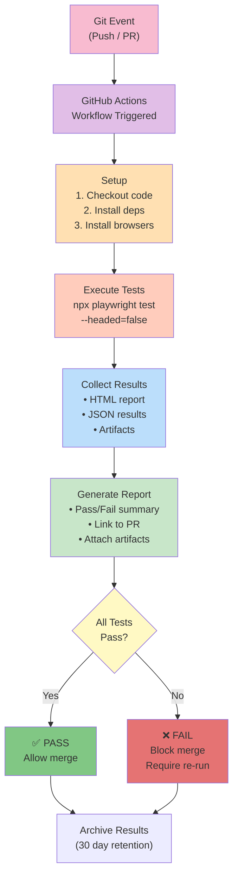

---

## 8. Component Interaction Matrix

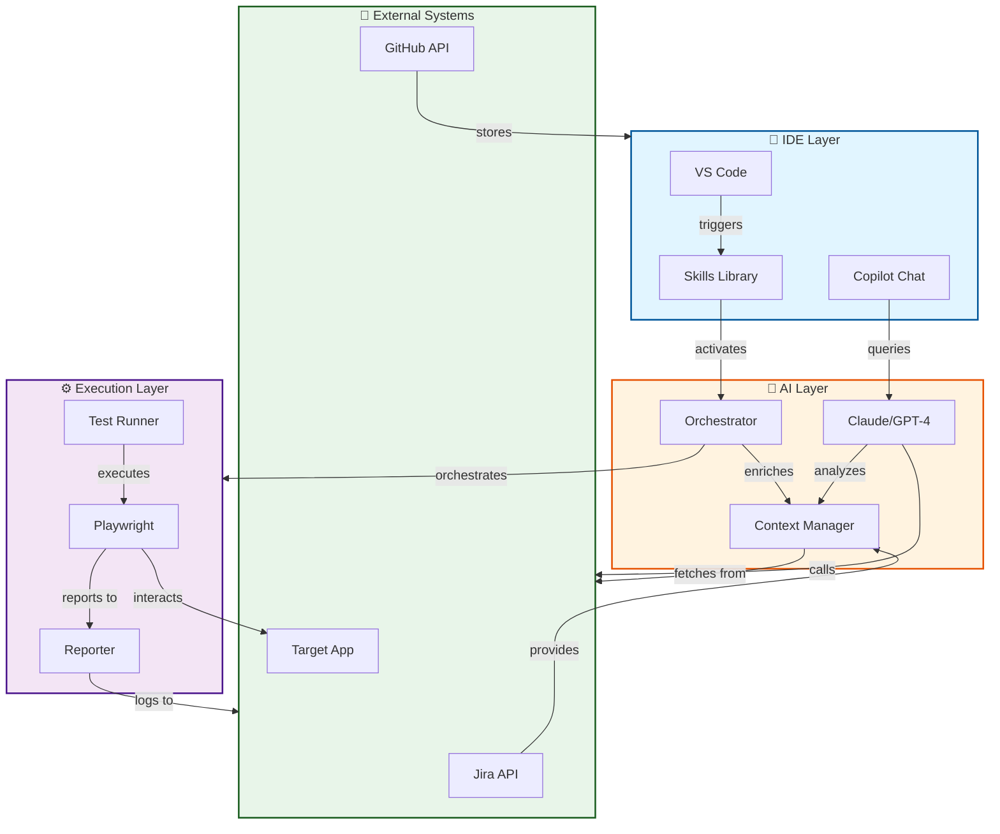

---

## 9. Workspace File Structure

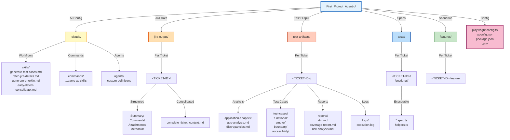

---

## 10. Security & Authentication Flow

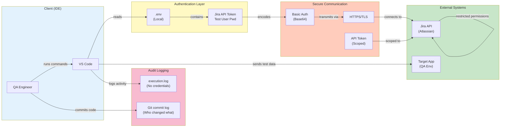

---

## 11. Skill Execution Lifecycle

```mermaid
stateDiagram-v2
    [*] --> UserTriggers: User runs slash command
    
    UserTriggers --> ParseInput: Parse & validate input
    ParseInput --> CheckPrecond: Check prerequisites
    
    CheckPrecond --> PrecondMet: Preconditions met?
    PrecondMet -->|No| FailPrecond: Fail - missing data
    FailPrecond --> [*]
    
    PrecondMet -->|Yes| LoadContext: Load context<br/>(Jira, app data)
    LoadContext --> ContextLoaded: Context ready?
    ContextLoaded -->|Partial| WarnPartial: Warn: partial data
    ContextLoaded -->|Full| ProcessStep
    
    WarnPartial --> ProcessStep: Continue with<br/>partial context
    
    ProcessStep --> StepLoop: Execute step 1..N
    StepLoop -->|More steps| StepExec: Execute step
    StepExec -->|error?| ErrorHandle: Error handler
    ErrorHandle -->|recoverable| Retry: Retry step
    ErrorHandle -->|fatal| FailStep: Fail - critical error
    
    Retry -->|success| LogStep: Log step completion
    StepExec -->|success| LogStep
    LogStep --> NextStep: Next step?
    NextStep -->|Yes| StepLoop
    NextStep -->|No| FinalSteps
    
    FinalSteps --> GenOutput: Generate output artifacts
    GenOutput --> WriteFiles: Write to filesystem
    WriteFiles --> UpdateCache: Update caches
    UpdateCache --> Complete: Skill complete ✅
    Complete --> [*]
    
    FailPrecond --> [*]
    FailStep --> [*]
    Complete --> [*]
    
    note right of ParseInput
        Examples:
        - Parse ticket ID
        - Extract app URL
        - Detect mode (JIRA/URL/BOTH)
    end
    
    note right of ErrorHandle
        Examples:
        - Jira API timeout
        - Browser crash
        - Invalid selector
        - Network error
    end
    
    note right of GenOutput
        Generates:
        - Markdown reports
        - JSON results
        - Gherkin features
        - Test artifacts
    end
```

---

## 12. Technology Stack Pyramid

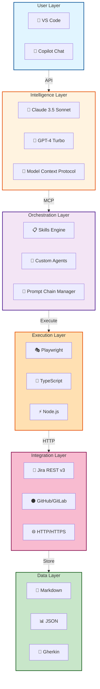

---

## 13. Deployment Architecture (Future State)

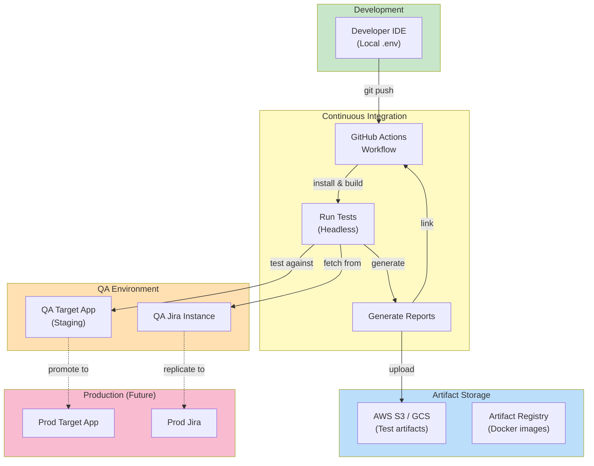

---

## 14. Monitoring & Observability

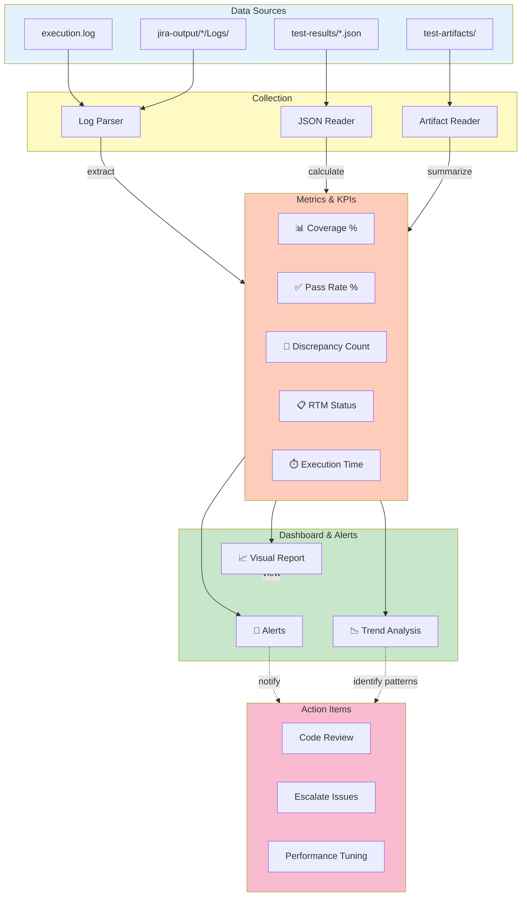

---

## Glossary

| Term | Definition |
|------|-----------|
| **AC** | Acceptance Criterion from Jira ticket |
| **BDD** | Behavior-Driven Development (Gherkin format) |
| **CI/CD** | Continuous Integration / Continuous Deployment |
| **Gherkin** | Feature specification language (Given/When/Then) |
| **MCP** | Model Context Protocol (AI tool bridging) |
| **RTM** | Requirements Traceability Matrix |
| **Skill** | Reusable AI workflow (`.claude/skills/`) |
| **Slack Command** | `/command` invoked in VS Code |
| **Test Case** | Individual test specification (TC-001, etc.) |
| **Discrepancy** | Deviation between spec and app (DISC-001, etc.) |

---

**End of Visual Diagrams Document**

---

*For detailed explanations of each component, refer to [TECHNICAL_ARCHITECTURE.md](TECHNICAL_ARCHITECTURE.md)*
