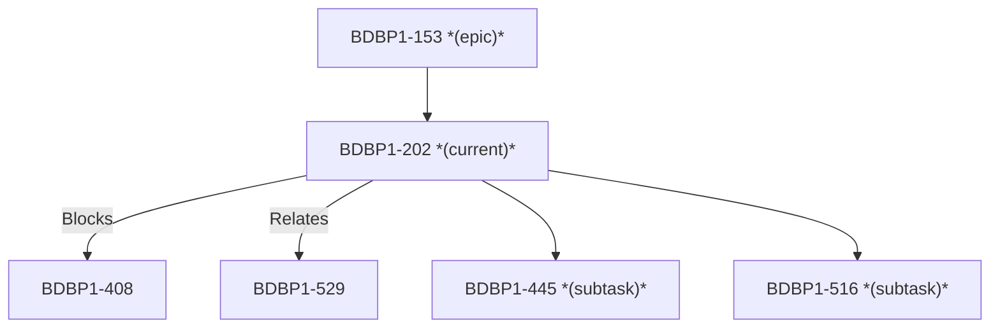

# Dependency Graph

```mermaid
graph TD
  BDBP1_202["BDBP1-202 *(current)*"]
  BDBP1_153["BDBP1-153 *(epic)*"] --> BDBP1_202
  BDBP1_202 -->|"Blocks"| BDBP1_408["BDBP1-408"]
  BDBP1_202 -->|"Relates"| BDBP1_529["BDBP1-529"]
  BDBP1_202 --> BDBP1_445["BDBP1-445 *(subtask)*"]
  BDBP1_202 --> BDBP1_516["BDBP1-516 *(subtask)*"]
```