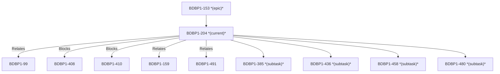

# Dependency Graph

```mermaid
graph TD
  BDBP1_204["BDBP1-204 *(current)*"]
  BDBP1_153["BDBP1-153 *(epic)*"] --> BDBP1_204
  BDBP1_204 -->|"Relates"| BDBP1_99["BDBP1-99"]
  BDBP1_204 -->|"Blocks"| BDBP1_408["BDBP1-408"]
  BDBP1_204 -->|"Blocks"| BDBP1_410["BDBP1-410"]
  BDBP1_204 -->|"Relates"| BDBP1_159["BDBP1-159"]
  BDBP1_204 -->|"Relates"| BDBP1_491["BDBP1-491"]
  BDBP1_204 --> BDBP1_385["BDBP1-385 *(subtask)*"]
  BDBP1_204 --> BDBP1_436["BDBP1-436 *(subtask)*"]
  BDBP1_204 --> BDBP1_458["BDBP1-458 *(subtask)*"]
  BDBP1_204 --> BDBP1_480["BDBP1-480 *(subtask)*"]
```