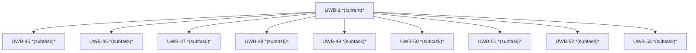

# Dependency Graph

```mermaid
graph TD
  UWB_1["UWB-1 *(current)*"]
  UWB_1 --> UWB_45["UWB-45 *(subtask)*"]
  UWB_1 --> UWB_46["UWB-46 *(subtask)*"]
  UWB_1 --> UWB_47["UWB-47 *(subtask)*"]
  UWB_1 --> UWB_48["UWB-48 *(subtask)*"]
  UWB_1 --> UWB_49["UWB-49 *(subtask)*"]
  UWB_1 --> UWB_50["UWB-50 *(subtask)*"]
  UWB_1 --> UWB_51["UWB-51 *(subtask)*"]
  UWB_1 --> UWB_52["UWB-52 *(subtask)*"]
  UWB_1 --> UWB_53["UWB-53 *(subtask)*"]
```